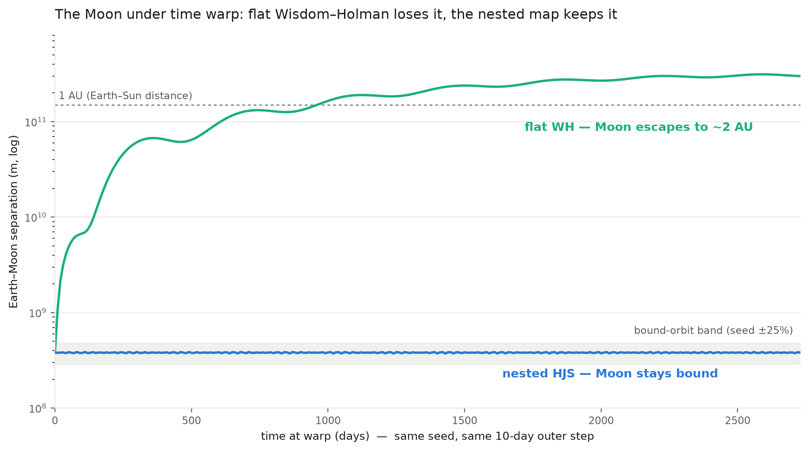

# Warping Without Losing the Moon

Last milestone I built the fast-forward button and then bolted a bouncer onto it. The Wisdom-Holman integrator — the fast, stable math that lets you warp time across millions of years — only works when one body clearly dominates and everything else is a gentle tug on top. A planet orbiting the Sun fits perfectly. The Moon orbiting the Earth orbiting the Sun does not. The Moon is held so tightly by the Earth that, from the Sun's point of view, it isn't a gentle tug at all — it's a full-blown second orbit. So the engine measured exactly that, boiled it down to a single number, found it too big, and correctly refused to warp the Moon.

The gate did its job. It also left me holding a fast-forward button that couldn't fast-forward any solar system with a moon in it. This milestone was about earning that capability back — properly.

## The idea: a simulation inside a simulation

The fix is an algorithm called HJS — hierarchical Jacobi symplectic, from a 2003 paper by Hervé Beust. The insight is simple once you see it. Space is *nested*. The Moon orbits the Earth. The Earth-Moon pair, treated as one thing, orbits the Sun. Jupiter's four big moons orbit Jupiter, and Jupiter orbits the Sun. Every one of those is a clean, dominant-body orbit — the exact situation Wisdom-Holman is great at — as long as you look at it *at the right scale*.

So instead of one flat list of bodies all measured from the Sun, HJS builds a tree. The Moon's position is tracked relative to the Earth. The Earth-Moon center is tracked relative to the Sun. Each little orbit gets solved exactly, in its own frame, and the answers stack up the hierarchy. The Earth-Moon system becomes a self-contained sub-simulation riding inside the bigger one.

The choice of coordinate frame matters more than it looks. M0.6's flat integrator used a frame astronomers call *democratic-heliocentric* — everything measured from the Sun, treated evenhandedly. It's a fine frame for planets, but run a tightly-bound satellite through it and it quietly injects a fake wobble into the orbit: an artificial precession that makes the orbit slowly rotate when it shouldn't. HJS's per-orbit Jacobi frames don't have that flaw. And I didn't have to take that on faith — later in the milestone the review gate put both frames on the exact same test orbit and measured it. The flat frame precessed at a rate the theory predicts almost to the decimal; the nested frame sat at the round-off floor, about **six billion times quieter**. The artifact is real, it's understood, and the new map doesn't have it.

## The recursion, and the moment it all pays off

There's one more layer. Io whips around Jupiter in under two days; Callisto takes over two weeks; the outer planets take years. If the whole simulation marched to Io's tiny beat, warp would crawl. If it marched to Jupiter's, Io would blur into garbage. HJS's answer is a recursive ladder of timesteps — a scheme from a 1998 paper by Duncan, Levison and Lee — where each orbit is allowed to substep at its own tempo *inside* its parent's step. At the settings the game runs, Io takes sixteen little steps for every one giant outer step, all wrapped in a careful palindrome so the whole thing stays reversible and energy-tight.

I checked that the ladder behaves the way the math says it should — halve the coupling between two bodies and the error should drop off on a clean straight line, and it did, a log-log slope of 1.03 against a theoretical 1.

Then comes the test I care about most. Take the real bound Moon — the exact configuration that sank the flat integrator — and run it two ways from the identical starting point, with the identical big timestep. The flat integrator, with no way to substep the fast lunar orbit, loses the Moon completely: it tears off the Earth and ends up wandering the inner solar system on its own, twice as far from the Sun as the Earth is. The nested map, automatically giving the Moon its own eight sub-steps, holds the orbit's energy steady to nine decimal places and keeps the Moon exactly where it belongs. Same seed, same step, and the nested version does about **five thousand times** better. That's the whole milestone in one number.

## Does it match the real sky?

Energy staying put proves the math is stable. It doesn't prove the Moon is in the *right place* — a lesson this project learned the hard way back in M0.5, when a stable-looking integrator turned out to be quietly wrong. So the Moon and the Galileans get checked against reality: JPL's DE441 ephemeris, the same measured planet-and-moon positions the actual space community navigates by. I pin real HORIZONS states, integrate forward, and compare — measuring first, then locking the tolerances, so no bound ever gets set looser than what the code actually earns.

The Moon tracks the real ephemeris to between six and twenty-four kilometers, geocentric, over a full month. That sounds like a lot until you remember the Moon is nearly four hundred thousand kilometers out — it's tracking to better than one part in ten thousand, and the small residual is exactly the stuff I'm knowingly not modeling yet (the pull of Venus, the Earth's equatorial bulge). Jupiter's moons show a slightly larger, cleanly-shaped residual dominated by Jupiter's own oblateness — the same known physics, showing up right where the theory says it should. Over a full simulated year the whole nine-body system's total energy holds to eleven decimal places, sitting at the floor of what the arithmetic can even represent. And the deepest warp ladders — hundreds of substeps deep — get position-checked against the ephemeris too, not just waved through on an energy check.

## The camera can finally watch it

The point of all this is that warp stops being a thing that happens off-screen. You can now sit the camera on the Earth-Moon system, hit warp, and watch the clock scream forward two thousandfold while the Moon keeps calmly circling the Earth — then ease back out to real time with no jump, no pop, no snap. The simulation you were watching is bit-for-bit the one that hands back control.

Getting that seam clean took an honest measurement I'll admit I didn't expect. There's a well-known refinement — a corrector from a 2006 Wisdom paper — that sharpens the handoff, and on a single-level orbit it's a monster: nearly 500 times more accurate. So naturally I wanted it everywhere. But when I measured it on the *nested* ladder, it made things about thirty times **worse**. So it's gated: the engine switches the corrector on exactly where it helps and leaves it off where it hurts. I'd rather ship the version I measured than the version I assumed.

## The deep end

For the folks who want the engineering: the piece I'm quietest-proud of is a provenance check. This whole coordinate machine has to produce identical results forever, on every machine — it's the bedrock the save system and any future multiplayer will stand on. To be sure the core transform was doing arithmetic in exactly the right order, I stood up the original ODEA Fortran code the method traces back to, fed both it and my C++ the same nine-body solar system, and compared the raw bits. Every real orbit component came out **identical to the last bit** — zero difference, not "close." The convention my code follows isn't a claim in a comment anymore; it's measured against the source.

One more, because it's a nice illustration of the bar: a review finding pointed out the interaction step was doing redundant work and could be sped up. I rewrote it and got a 4.7× speedup on the hot path — but the rule here is that a performance change to locked physics has to prove it didn't move a single bit of any trajectory. It did prove it, byte-for-byte, and only then did it land. Fast is nice; identical is mandatory.

The milestone closed the way they all do now — an independent adversarial review across a couple dozen angles, every serious finding fixed before the gate opened. No criticals, and the ones that surfaced (a missing safety guard here, a blind spot in the warp telemetry there) all got closed in place.

## What's next

The Moon is where NASA says it is, at warp, and the camera can watch it get there. Next up is a milestone about the *last* few percent of accuracy — the perturbation refinements: general relativity's tiny correction to gravity, and the bulge-of-a-planet term that shapes close satellite orbits. The flagship target is Mercury. Newton's gravity gets Mercury's orbit almost right, but it famously drifts by 43 arcseconds per century that Newton can't explain and Einstein can. Getting the engine to reproduce that number, on its own, from the physics — that's the one I've been waiting for.

---

*Built solo by Spoods Studios.*
