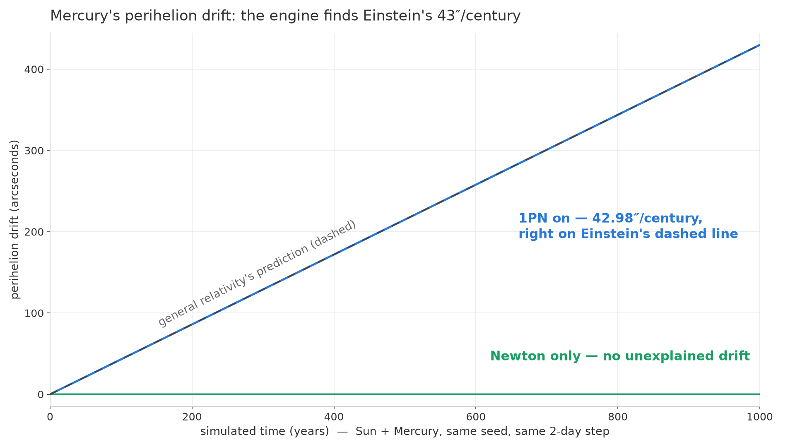

# Making Mercury Precess

In 1859, the astronomer Urbain Le Verrier noticed something wrong with Mercury. Its orbit isn't a fixed ellipse — the ellipse itself slowly rotates around the Sun, and after accounting for every planet tugging on it, a tiny leftover drift remained: 43 arcseconds per century. That's about one hundredth of a degree every hundred years. Newton's gravity had no explanation. People hunted for a hidden planet inside Mercury's orbit for decades. Then in 1915, Einstein sat down with his brand-new general relativity, computed Mercury's orbit, and the missing 43 arcseconds fell straight out of the equations. He later said the discovery gave him heart palpitations.

This milestone, my engine reproduced that number. I pointed it at Mercury, let the physics run for a simulated century, and measured the drift: **42.98 arcseconds**.

## What changed

Until now the engine's gravity was pure Newton: every body pulls on every other body, proportional to mass, falling off with distance squared. That gets you astonishingly far — the whole solar system to kilometer-level accuracy over months. This milestone added the last two corrections that real mission planners can't live without, and neither one is large.

The first is relativity. General relativity's correction to gravity near the Sun is minuscule — for Mercury it shifts the force by parts in ten million — but it acts in the same direction every orbit, and it compounds. Over a century those parts-in-ten-million add up to exactly the drift Le Verrier measured. The engine now carries that correction through the same force pipeline as everything else.

The second is the shape of the planets themselves. I'd been treating every body as a perfect point of mass, but real planets spin, and spinning flattens them. Earth is 21 kilometers wider at the equator than pole-to-pole; Saturn is squashed by a full 10%. That equatorial bulge gives close-in moons and satellites an extra tug, and it's the dominant perturbation for anything orbiting low. Astronomers call it J2. Every planet in the engine now has its measured J2 value, its real radius, and its real spin axis, from Mercury all the way out to Neptune.

My favorite consequence of getting J2 right: sun-synchronous orbits now work. Weather and spy satellites fly a particular tilted orbit that uses Earth's bulge as a free steering motor — the bulge twists the orbit plane exactly once around per year, so the satellite crosses the equator at the same local time forever. That behavior falls out of the J2 physics, and the engine now reproduces the textbook rate. If I put a satellite on that orbit, it stays sun-synchronous because the *shape of the Earth* keeps it there.

## Checking it against the sky

The Mercury number is the flagship, but one number can flatter you. So the whole thing gets checked against JPL's DE441 ephemeris — the measured positions of the planets that real missions navigate by.

The live simulation now runs all fourteen major bodies — Sun, eight planets, the Moon, and Jupiter's four big moons — with both corrections switched on. The acceptance test is blunt: with relativity and J2 enabled, the engine's predicted positions for the inner planets must land *closer* to JPL's data than the Newtonian-only run, epoch after epoch. They do. And the outer-planet J2 values got their own reality check — Saturn's bulge tested against Mimas, Uranus's against Miranda, Neptune's against a moon called Naiad skimming so low that J2 twists its orbit by degrees per day. Each one compared against the real measured moon positions.

One design rule made all of this safe to ship: both corrections are additive layers on top of the locked Newtonian core. Switch them off and the engine produces bit-for-bit the same trajectories as last milestone — the diff is exactly zero, byte for byte. Switch them on and you get the refined physics. Nothing underneath was touched.

## The deep end

Here's the part I want to nerd out about, because the relativity implementation has a genuinely weird feature, and it caused the milestone's best bug.

The correction I used comes from a 1994 paper by Saha and Tremaine, built to slot into fast long-term integrators like mine. To keep the math clean and stable, it plays a trick: inside the integrator, bodies don't carry their true velocities. They carry *pseudo-velocities* — a slightly redefined velocity, off from the real one by a relativistic hair (for Earth, a few millimeters per second). The integrator's internal bookkeeping is all in pseudo-velocities; you're supposed to convert back to true velocities at the boundary, whenever the outside world looks in.

The engine has more boundaries than I'd been thinking about. Entering time warp: converted. Leaving time warp: converted. But there's a third path — while you're *sitting in* warp, the renderer peeks at the live simulation every frame to draw the planets. That peek exported the internal state raw. Pseudo-velocities, published as real ones, to everything watching: the camera, the telemetry, the kinetic-energy readouts. Positions were fine, but every velocity readout during warp was subtly, systematically wrong — by a few millimeters per second, forever, in a way no energy check inside the integrator would ever notice, because internally nothing *was* wrong.

The fix is the kind I like: the peek path now copies the state and converts the copy, leaving the live simulation untouched, and a regression test pins the published velocity to the true-velocity export so the raw internal state can never leak again.

A second find in the same family: Newton's third law. The relativistic correction was pushing on the planets, but the matching reaction on the Sun was missing — every orbit, a tiny unbalanced force on the system. The planets' orbits relative to the Sun were perfect (Mercury's 42.98 doesn't move), but the solar system's center of mass was drifting about 650 meters per 50 years when it should sit still. Both the simulation and its validation harness now share one force routine, momentum-conserving, so the convention can't silently fork again.

Both of those came out of this milestone's independent review pass, got reproduced empirically, fixed, and locked under regression tests before the milestone closed. Final tally: 656 tests green, and the Newtonian core still byte-identical to the day it was locked.

## What's next

This milestone closes out the engine's foundation phase. The gravity is nested, warpable, relativistic, and checked against the real sky — the physics bedrock I wanted before building anything on top of it. Next comes the part where it starts becoming a game: a controllable spacecraft. Six degrees of freedom, real thrust, real fuel consumption obeying the rocket equation, flying through this gravity field. It's about to get real baby. 

---

*Built solo by Spoods Studios.*
