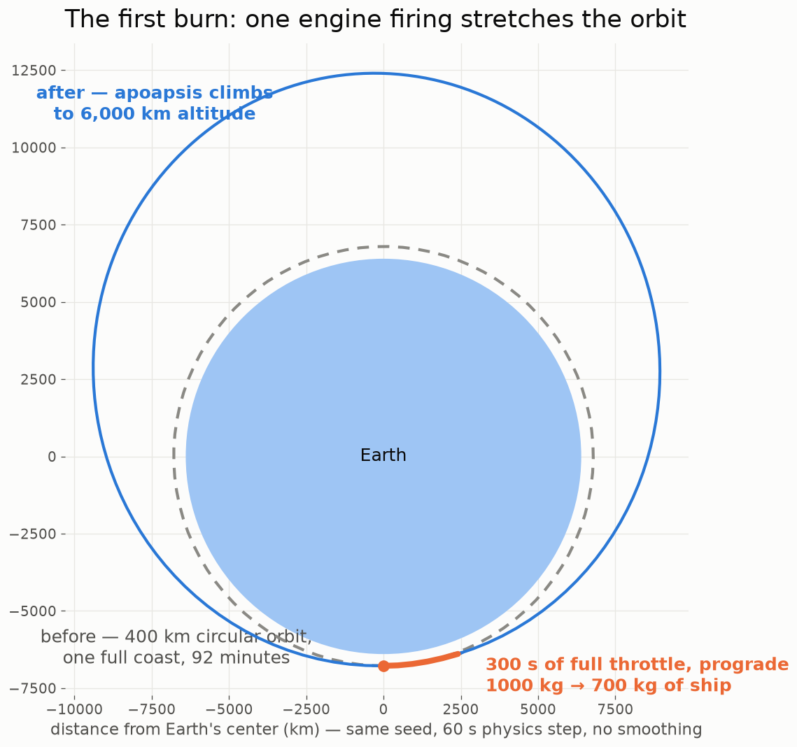

# First Burn

Every milestone until now has been about planets. Fourteen bodies, real ephemeris data, relativity, the works — and nothing in it you could touch. This milestone the engine got a ship. You point it, you throttle up, the orbit changes shape in front of you, and the fuel gauge goes down by exactly the amount the rocket equation says it should.

## What changed

Three new pieces of physics, each built standalone and proven against closed-form math before touching the live simulation.

**Attitude.** The craft is a rigid body now: orientation, spin, a real inertia tensor. Torque turns it, and once it's spinning it keeps spinning the way real objects do — including the weird way. There's a famous effect where an object spun around its middle axis doesn't just spin, it periodically flips end over end. Cosmonaut Vladimir Dzhanibekov noticed it on Salyut 7 watching a wingnut tumble, and it looks so wrong that it reads like a physics bug. It's the opposite. It falls straight out of Euler's equations, and the engine reproduces the flip against the textbook solution — that fixture is now one of the tests that pins the attitude math down permanently.

**Thrust and fuel.** The main engine obeys Tsiolkovsky's rocket equation, the 1903 result that governs every rocket ever flown. Burning fuel makes the ship lighter, so the same thrust accelerates it harder as the burn goes on. The engine carries the mass depletion through the integrator honestly, and the acceptance test compares a full burn against the closed-form prediction. If the delta-v is wrong, the milestone doesn't close.

**RCS.** Twelve small thrusters arranged around the hull for fine control. The interesting problem is allocation: when you push "translate left," which thrusters fire, and how hard, so the ship slides left *without* also starting to rotate? The engine solves the allocation algebraically, and there's a proof in the test suite that every pure translation command produces exactly zero rotation — not approximately zero, zero.

All of it rides on top of the gravity core from the last eight milestones, threaded through the same seams the planetary perturbations already use. With no craft in the scene, the simulation is byte-for-byte identical to the previous release — the foundation stayed locked while the ship got built on top of it.

Then there's flying it. Input goes through a fixed-timestep channel so the physics is deterministic no matter your framerate, a debug HUD shows attitude, orbital elements, fuel and delta-v remaining, and the whole thing runs at 128× time acceleration so you can watch a burn reshape an orbit that takes ninety minutes in real life.

## The deep end

Before any milestone's physics gets locked, it goes through an independent review pass, and this one produced my favorite crop of bugs yet. The propulsion math itself came back clean — Tsiolkovsky, the thrust law, the fuel bookkeeping all re-derived and confirmed correct. Every real find was in the seams where the new ship meets the old engine. Three worth telling.

**The benchmark that couldn't fail.** The gravity-loss test — the one checking that burning against gravity costs you delta-v the way the textbooks say — was computing its "textbook answer" from the same numbers the simulation produced. It was grading its own homework. The test passed to eleven decimal places while sitting on top of a real 2.45 m/s error, about 2% of the burn. The oracle now derives the burn time independently from the propellant budget, and the residual dropped four orders of magnitude honestly.

**The stuck key.** The input channel between the game and the physics is a ring buffer, and under sustained input it could fill up. The original policy dropped the newest event when full — which sounds harmless until the dropped event is *you letting go of the key*. The craft would keep firing thrusters on a key you'd already released; the test that caught it measured a ship spinning up through 9.58 radians per second with no key held. The channel now overwrites the newest slot instead, so a release edge can never be lost.

**Free propellant.** The RCS thrusters weren't drawing fuel. I'd waved this off during the milestone as too small to matter. The review did the arithmetic: at the shipped thruster ratings, an hour of simulated RCS use is 720 m/s of delta-v — about a quarter of the whole main-engine budget — for free. RCS draws from the tank now, through the same mass-depletion path as the main engine, and an empty tank means no control authority, exactly like real spacecraft.

Eleven fix phases landed over three days to close everything the review surfaced. Final tally: 977 tests green, and the deterministic core is still byte-identical to the day it was locked, two milestones ago.

## What's next

The ship flies, but at a 300-second physics step you fly it at 128× or not at all — down at 1× the world advances in five-minute chunks. Next milestone attacks exactly that: a finer simulation step for the craft so you can launch and burn at real time, plus the first maneuvering tools to plan a burn instead of eyeballing it. The orbit you change next time will be one you *meant* to change.

---

*Built solo by Spoods Studios.*
