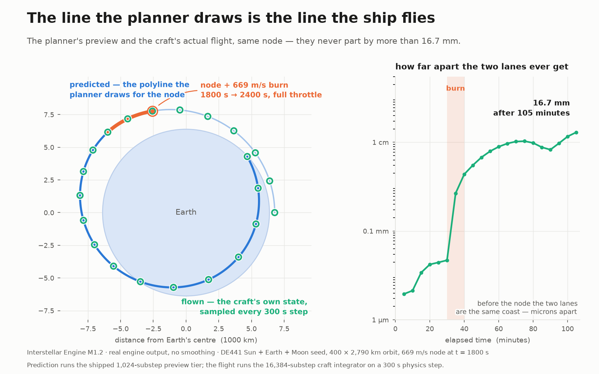

# The Line You Fly

Last milestone the engine got a ship you could fly. This milestone it got maneuver nodes — predict and plan your craft's next move before you burn. Click anywhere on your orbit and a maneuver node appears there. Drag its handles and a new trajectory draws itself in real time — here's where you'll go if you burn like this, at that moment. Then you fly the burn yourself, by hand, and the ship follows the line.

## Planning a burn

The pieces will feel familiar if you've played anything in this genre. A node sits at a point on your future orbit. Six handles come off it: prograde and retrograde, normal and anti-normal, radial in and out. Dragging them builds up the burn, direction by direction. The readout shows the total Δv, the per-axis breakdown, and how long the engine will need to fire to deliver it. That burn time comes from your ship's actual mass and thrust, computed through the rocket equation. Ask for more than your fuel can give and the node doesn't stop you. It flags the overrun and lets you keep sketching.

While you drag, the predicted path redraws live. The part of the trajectory before the node never moves — you haven't changed anything about how you get *to* the burn. The part after it swings around as the plan changes. All of it happens on a map view you can now drive with the mouse: pan, zoom, click to place, grab a handle. The predicted path draws in green; the trail you've actually flown stays amber.

## Why the line is trustworthy

Most games compute the planned trajectory with a simplified model — patched conics, usually: pretend only one body pulls on you at a time, then glue the pieces together. It's fast and it's close. But this engine simulates every body pulling on your ship, all the time. "Close" drifts. If the planner uses simpler physics than the flight, the line you drew stops matching the path you actually fly.

So the predictor here doesn't get its own physics. There is exactly one piece of code that advances the craft: the same substep kernel, stepping the same forces, at the same precision. Both the live flight and the trajectory prediction call it. The predictor literally cannot disagree with the flight code about physics, because there is no second copy of the physics to disagree with. The architecture guarantees the match — there is only one implementation, so nothing needs separate calibration. It's tested, too: the suite flies burns and measures the gap between the predicted line and the flown path. Locked tolerances fail the build if that gap grows.

## The bug that had to die first

None of this was buildable on the ship the last milestone left behind. The planets integrate on a 300-second step, sized for how slowly they move. The craft rode that same step. Over a single low orbit, that accumulated 546 kilometers of position error. You couldn't watch a launch at real time, because the orbit visibly decayed while you watched. Every accuracy claim about nodes would have been measured against a coast that was already wrong.

The fix gives the craft its own fine substep. It's derived from the same symplectic-integrator family the rest of the engine uses. The planets are untouched. The residual error over that same orbit is now about a millimeter — a known, bounded rounding effect with its own regression test. As a side effect, the game became playable at 1× real time with fine throttle control.

## The deep end

Three things stand out. A full bidirectional converter now moves between position/velocity states and classical orbital elements, verified against standard textbook test cases across circular, elliptical, near-parabolic, and hyperbolic orbits. The numerically nasty spots — near-zero inclination, the parabolic edge — are conditioned so they don't silently lose precision. The map-view input layer does its hit-testing in screen pixels, so a click means the same thing on every window shape. A milestone-closing review turned up 148 distinct findings; every critical and high-severity one was resolved before the milestone closed. Several were the kind of subtle seam bug — two clocks disagreeing about one instant, a stale marker surviving a rebuild window — that only shows up when someone goes looking for it.

## What it cost

The feature work — subcycling, conversions, the shared kernel, nodes, prediction, map view — went roughly to plan. Finding and fixing the bugs it exposed took longer than building it: more time went into closing problems at the seams between working components than into writing the features themselves. I've stopped resenting that pattern. Those seams are exactly where a solo project goes blind, and every bug caught there is one that never reaches a player. Deferred honestly: burn planning doesn't yet model the throttle ramp flown at very high time-warp (the planned-vs-flown match is proven for burns executed as scheduled), and a handful of accuracy refinements are queued for next milestone. As with other games, maneuver nodes assume immediate velocity change at that exact point, which isn't possible in real life. That's why in games like KSP you start burning before you reach the node and cross the node while still burning.

## What's next

The ship flies. Now it can plan maneuvers. What it can't do yet is care *where* it's going — there's no target, no rendezvous, no "get me to the Moon" beyond your own eye on the map. Making planned flight mean something is the next problem.

---

*Built solo by Spoods Studios.*
